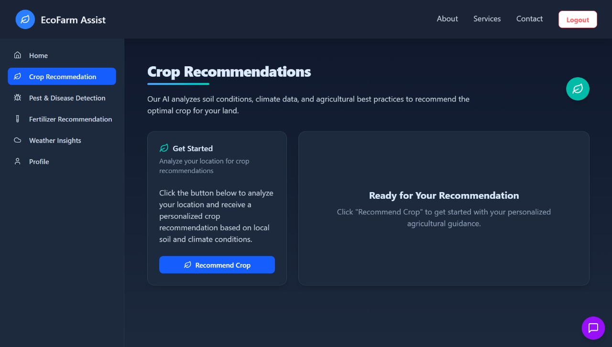
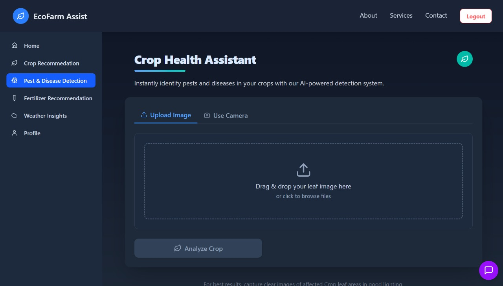
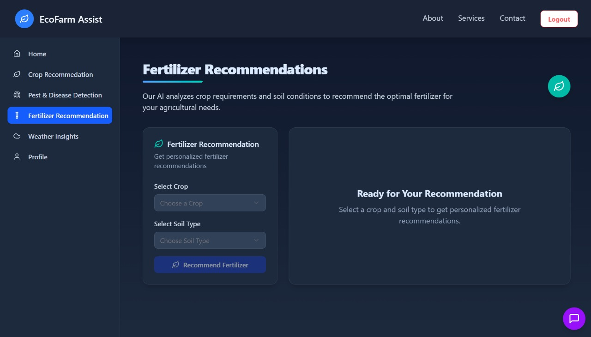
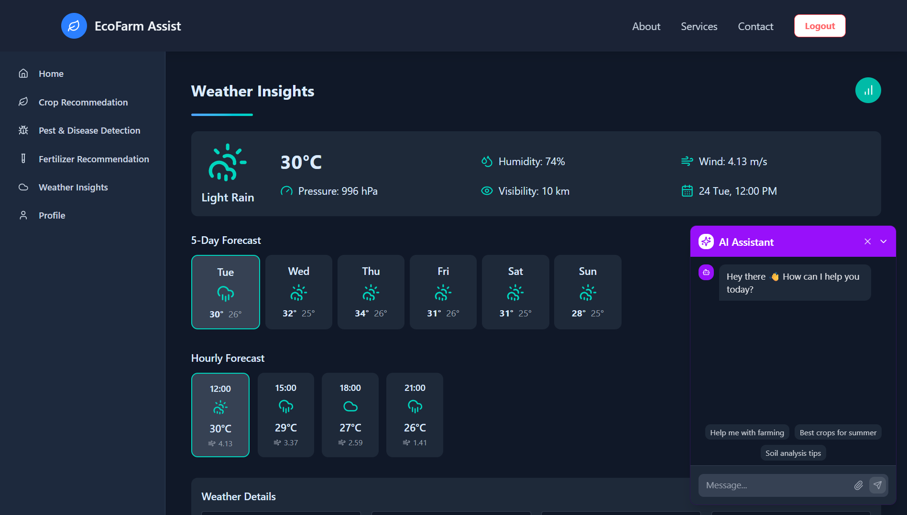

# 🌾 Eco-Farm Assist: Empowering Small & Marginal Farmers with AI

**Eco-Farm Assist** is an AI-driven agricultural advisory platform designed to empower India's small and marginal farmers. By combining the power of satellite data, weather APIs, and scalable ML models, it provides personalized and real-time advice on crop planning, fertilizer use, and disease detection.

> 🚜 Bridging the gap between technology and grassroots agriculture through intelligent, location-aware recommendations.

---

## 📌 Why Eco-Farm Assist?

- Traditional advisory systems provide **generic, static advice** that ignores location, seasonality, and soil type.
- Farmers lack **real-time, personalized insights** to make smart decisions.
- There is **low adoption of AI and satellite data** in rural agriculture.

**Eco-Farm Assist** solves this by delivering:
- 📍 Location-specific crop recommendations using **Google Earth Engine**
- 🌦️ Real-time weather-aware suggestions via **weather APIs**
- 🧠 Scalable **ML models** for intelligent farming decisions

---

## 🛠️ Tech Stack

Eco-Farm Assist is powered by a modern, scalable and modular tech stack:

### 🌐 Frontend
- **Next.js 15** – Full-stack React framework for server-side rendering and routing
- **Tailwind CSS + tailwind-merge + tailwindcss-animate** – Utility-first styling with animation support
- **Lucide React**, **Font Awesome**, **Geist UI** – Icon & UI libraries for rich visual experience
- **Framer Motion** – Fluid animations for engaging UX
- **React Hook Form + Zod + @hookform/resolvers** – Robust form handling and validation
- **Embla Carousel**, **react-scroll**, **usehooks-ts** – Enhanced UI interactions and hooks

### 🔐 Authentication & Security
- **NextAuth.js** – Secure user authentication and session management
- **JWT + bcryptjs** – Token-based authorization and password hashing
- **dotenv** – Secure environment variable management

### 🌱 Backend & APIs
- **Google Earth Engine** – Satellite-based geospatial intelligence
- **Google Generative AI (Gemini)** – Smart query answering via NLP
- **Vertex AI** – Deployed ML models for crop, fertilizer, and disease prediction
- **Mongoose + MongoDB** – Scalable NoSQL database
- **Nodemailer + React Email** – Transactional emails for sign-up and verification

### 🧰 Developer Tools
- **ESLint + Prettier** – Code linting and formatting
- **TypeScript** – Type-safe development
- **Axios** – Promise-based HTTP client for all API communication
- **PostCSS + Autoprefixer**, **clsx**, **glob** – Utility libraries for modern development

---

## 📡 API Structure

> Location: `src/app/api/`

```
├───auth
│   └───[...nextauth]
├───change-password
├───chatbot
├───confirm-password-validation
├───crop-prediction
├───disease-prediction
├───fertilizer-recommendation
├───geocode
├───get-latest-advice
├───password-validation
├───sign-up
├───soil-data
├───verify-code
├───weather-data
```

### Key API Endpoints

- `POST /api/sign-up` – Register a new farmer
- `POST /api/auth/[...nextauth]` – Login and authentication
- `POST /api/crop-prediction` – Get crop recommendations based on soil & weather
- `POST /api/fertilizer-recommendation` – AI-based fertilizer suggestions
- `POST /api/disease-prediction` – Image-based crop disease detection
- `GET /api/soil-data` – Fetch soil pH, NPK, and moisture using GEE
- `GET /api/weather-data` – Real-time weather forecast for user location
- `POST /api/chatbot` – Smart conversational chatbot using Gemini
- `GET /api/get-latest-advice` – Daily farming tips personalized for user

---

## 🚀 Deployment

- **Frontend**: [Render](https://eco-farm-assist.onrender.com)
- **Backend**: Same monorepo deployment on Render with serverless architecture
- **GitHub**: [https://github.com/Sudhanshu-NITR/EcoFarm-Assist](https://github.com/Sudhanshu-NITR/EcoFarm-Assist)
- **Demo Video**: [YouTube Link](https://youtu.be/5b-l-AnCuZo)

---

## 🧪 Getting Started

### 📦 Prerequisites
- Node.js (v18+)
- npm or yarn
- `.env` file with required secrets

### 📂 Installation

```bash
git clone https://github.com/Sudhanshu-NITR/EcoFarm-Assist.git
cd eco-farm-assist
npm install
```

### 🚀 Running the App

```bash
npm run dev
```

### 🔐 Required `.env` Variables

```env
# Database
MONGODB_URI=your_mongodb_connection_uri

# Email (Transactional Email via Brevo)
BREVO_EMAIL=your_email@example.com
BREVO_SMTP_KEY=your_brevo_smtp_api_key

# Authentication
NEXTAUTH_SECRET=your_nextauth_secret

# Google AI (Gemini + Vertex AI)
GEMINI_API_KEY=your_google_gemini_api_key
VERTEX_ENDPOINT_ID_CROP_REC=your_vertex_ai_crop_endpoint_id
VERTEX_ENDPOINT_ID_FER_REC=your_vertex_ai_fertilizer_endpoint_id

# Google Maps + Weather
NEXT_PUBLIC_GOOGLE_MAPS_API_KEY=your_google_maps_browser_api_key
NEXT_PUBLIC_OPENWEATHERMAP_API_KEY=your_openweathermap_api_key

# Google Cloud & Earth Engine
GCP_PROJECT_ID=your_gcp_project_id
GCP_REGION=your_gcp_region
GOOGLE_APPLICATION_CREDENTIALS_BASE64=base64_encoded_service_account_json
EARTH_ENGINE_SERVICE_KEY=your_earth_engine_service_key
```

---

## 📸 Screenshots

<!-- Add screenshots of key pages -->

#### Landing Page  


#### Crop Recommendation


#### Disease Detection  


#### Fertilizer Recommendation   


#### Weather Insights Page  



---

## 🔭 Future Roadmap

- 🌍 Regional language support with dynamic translation
- 📱 Progressive Web App (PWA) version
- 🧠 Advanced pest detection model integration
- 📈 Market price prediction module
- 📡 IoT sensor integration for real-time field data

---

## 🤝 Team

**Team Name:** Red Bull Coders  
**Team Lead:** Sudhanshu Kadam  
**Team Members:**
- Swaraj Jamkar  
- Sakshi Bihani

----

> “Farming is not just a profession, it's a responsibility. Eco-Farm Assist is our small step towards making it smarter, easier, and more rewarding.”
